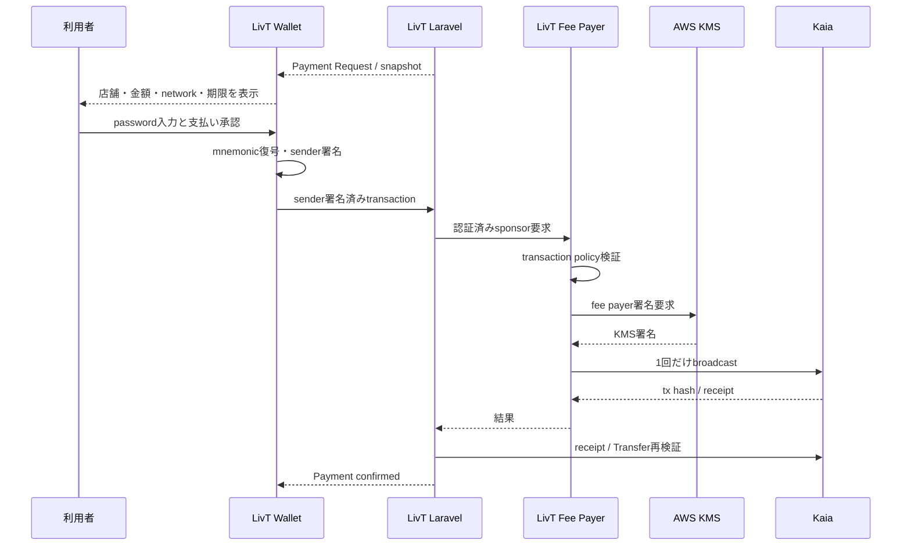

# LivT Wallet

LivT Walletは、JPYCの保有・受取・送金・店舗支払いに集中したnon-custodialブラウザWalletです。利用者のmnemonicと署名鍵は端末内で扱い、LivTやFee Payerへ渡しません。

## 概要

一般的な暗号資産Walletの機能を増やすのではなく、JPYC決済に必要な操作を短く、安全にすることを優先しています。

- 広告なし
- NFT表示なし
- Swapなし
- 価格チャートなし
- トークン購入機能なし
- 任意token importなし
- JPYCの残高、受取、送金、LivT Paymentに集中

## Mainnet実証

2026年9月17日、LivT WalletからKaia Mainnet上で1 JPYCの支払いに成功しました。

| 項目 | 結果 |
|---|---|
| Network | Kaia Mainnet |
| Chain ID | `8217` |
| Amount | `1 JPYC` |
| SenderのKAIA残高 | `0 KAIA` |
| Sender署名 | LivT Wallet内でローカル署名 |
| Gas | LivT Fee Payerが負担 |
| Payment | Laravelで`confirmed` |
| Transaction | [`0xc045…9779`](https://kaiascan.io/ja/tx/0xc045b4894d6e6bbd4178422dc63bd36ecf5eee9478ad393cc1f150b942ef9779) |

この結果は、承認済みsenderと1 JPYC Paymentに限定したMainnet pilotです。任意のMainnet送金を無制限に許可するものではありません。

## 主な機能

- BIP39 mnemonicによるWallet生成
- EVM addressの導出・表示・コピー
- 暗号化済みWalletのロック解除
- KAIA / JPYC残高表示
- JPYC受取画面
- 承認済みJPYCの直接送金
- LivT Payment URL / Payment IDの読み取り
- Payment限定ログイン
- 支払い内容と期限の確認
- sender transactionの端末内署名
- Kairosの直接送信とFee Delegation
- Mainnet pilotの必須Fee Delegation
- receiptとLaravel confirmationの結果表示

## 設計思想

LivT Walletはnon-custodialです。

- mnemonic、秘密鍵、Wallet passwordをLaravelへ送らない
- 署名が必要な間だけmnemonicを復号し、`LocalAccount`を生成する
- serverから受け取ったPaymentをそのまま信用せず、Zod schemaとnetwork profileで検査する
- 金額は浮動小数点ではなく`bigint`のatomic unitsで処理する
- MainnetでFee Payerが利用できない場合は直接送信へfallbackしない
- broadcast結果が不明なtransactionを自動再送しない

## 現在の鍵保存方式

Wallet作成時に12単語のBIP39 mnemonicをブラウザ内で生成します。mnemonicはpasswordから導出した鍵で暗号化し、暗号文だけを`localStorage`へ保存します。

| 項目 | 実装 |
|---|---|
| 暗号 | AES-256-GCM |
| KDF | PBKDF2-HMAC-SHA-256 |
| Iterations | `310,000` |
| Salt | 暗号化ごとに16 byteをランダム生成 |
| IV | 暗号化ごとに12 byteをランダム生成 |
| 保存先 | ブラウザ`localStorage` |
| 保存内容 | version、address、ciphertext、salt、IV、KDF metadata |

password、平文mnemonic、private keyは保存payloadへ含めません。復号後は保存addressとの一致を再確認します。

ただし、現在はブラウザlocalStorage依存です。別ブラウザ・別端末・別profileへ自動同期されません。また、mnemonicのexport/importや安全なbackup/recovery UIは未実装です。ブラウザデータを失うと、現在のUIだけでは復元できません。この制約を解消するまでは一般利用向けの完成したaccount recoveryとはみなせません。

## LivTとの決済フロー



Wallet側の成功表示だけでPaymentを確定しません。Laravelの共通verifierがchain ID、token、recipient、amount、receiptを確認した後に完了となります。

## Fee Delegation

Kaiaの`FeeDelegatedSmartContractExecution`を利用します。

1. WalletがERC-20 `transfer`を構築します。
2. 利用者のaccountでsender部分だけを署名します。
3. Laravelの`/api/payments/{id}/sponsor`へ1回だけ送ります。
4. Fee Payerが追加署名し、gasを負担します。
5. Walletはtx hashを受け取り、receiptとLaravel confirmationを待ちます。

MainnetではFee Delegationが必須です。Fee Payer availabilityを確認できない場合、支払いボタンは無効になり、利用者のKAIA不足警告も表示しません。Kairosでは既存のFee Payer / 利用者自身のKAIA選択を維持しています。

## Mainnetの二重送信防止

- Mainnet Paymentは署名前に`sessionStorage`へattempt guardを保存
- guardはPayment IDとsender addressでscopeを分離
- sponsor requestが送られた可能性があるtransport failureは`unknown submission`として扱う
- malformedな成功responseも結果不明として扱う
- 明確なpre-submit client errorは通常の失敗として扱い、誤って「送信済みかもしれない」と表示しない
- `unknown submission`では再送ボタンを出さず、自動retryしない
- Mainnetでdirect broadcastへfallbackしない
- 既知tx hashがある場合は新規送信ではなくconfirmationのみ再試行可能

`sessionStorage`は永続ledgerではないため、LaravelとFee Payer側の監査・replay protectionも併用します。

## 対応ネットワーク

| Network | Chain ID | 実装上の扱い |
|---|---:|---|
| Kaia Kairos | `1001` | 開発、直接送信、Fee Delegation、E2E |
| Kaia Mainnet | `8217` | release artifactとruntime gateを必要とするpilot |

JPYC contractは両profileで承認済みaddressに固定し、bytecode、`symbol()`、`decimals()`も検証します。networkはbuild modeから推測せず、`VITE_BLOCKCHAIN_NETWORK`で明示します。

Mainnet profileはコード上のrelease capabilityとruntime flagの両方がなければ実行可能になりません。通常の開発・テストでMainnetを暗黙に有効化することはありません。

## 技術スタック

- React
- TypeScript
- Vite
- pnpm / Corepack
- viem
- `@kaiachain/viem-ext`
- `@scure/bip39`
- Zustand
- Zod
- Web Crypto API
- Vitest / happy-dom
- Playwright
- ESLint

## ディレクトリ構成

```text
apps/web/src/app          React UIと画面遷移
apps/web/src/wallet       BIP39、暗号化保存、解除、署名account境界
apps/web/src/blockchain   network profile、chain、RPC境界
apps/web/src/tokens       JPYC metadata、残高、送金、Fee Delegation
apps/web/src/payments     LivT API、Payment検証、進行状態
apps/web/tests/unit       offline unit tests
apps/web/tests/integration component間のoffline integration tests
apps/web/e2e              browser E2EとKairos手動review runner
docs                      設計・レビュー資料
```

## セットアップ

Node.jsとCorepackを用意します。

```bash
corepack pnpm install
cp apps/web/.env.example apps/web/.env
corepack pnpm dev
```

設定する主な変数名:

- `VITE_LIVT_API_BASE_URL`
- `VITE_BLOCKCHAIN_NETWORK`
- `VITE_BLOCKCHAIN_KAIROS_RPC_URL`
- `VITE_BLOCKCHAIN_KAIA_MAINNET_RPC_URL`
- `VITE_MAINNET_PAYMENTS_ENABLED`

実際のcredentialやprivate endpointをREADMEやGitへ保存しないでください。HTTPSを基本とし、HTTPはloopback開発時だけ許可されます。

## 開発・テストコマンド

```bash
corepack pnpm test
corepack pnpm test:integration
corepack pnpm typecheck
corepack pnpm lint
corepack pnpm build
```

ブラウザE2Eは別プロセスとテストDBを使います。実networkを利用するreview commandはunit testとは異なるため、意図せず実行しないでください。

Kairosで明示的に手動レビューする場合のcommandは次です。

```bash
corepack pnpm review:kairos-live
corepack pnpm review:kairos-fee-delegated-live
```

## Mainnet運用上の注意

- `.env`やactivation artifactをGitへcommitしない
- build capabilityとruntime flagの双方をoperatorが確認する
- Laravelのreadiness / preflight / gate statusが`LIVE_ENABLED`になる前に署名しない
- Payment ID、sender、merchant、金額、期限を画面上で再確認する
- `unknown submission`を再送で解消しない
- live window終了後はLaravelとFee Payerのkill switchを戻す

READMEはMainnet実行手順書ではありません。実行時はLivT側のレビュー済みrunbookを使用してください。

## 現在の制約

- browser localStorage依存で、別端末への同期はない
- mnemonic export/import、account recovery、cloud backupは未実装
- Google login、passkey、WebAuthn、生体認証は未実装
- native mobile appは未実装
- Mainnetは単一pilot allowlistを前提とする
- Wallet単体ではFee PayerやLaravelの永続attempt状態を復旧できない
- 大きなbundleの分割やモバイルUXには改善余地がある

## Roadmap

- WebAuthn / passkeyとbiometric UX
- 安全なkey backup / recovery
- mobile app
- Payment attemptのserver-side recovery表示
- Fee Payer状態とgas sponsor UXの改善
- Polygonなど追加networkの調査（未実装）

## Related repositories

- `jpyc-web3-payment-platform`: LivT Laravel backend、Payment管理、検証
- `livt-fee-payer`: self-hosted Fee Payer、AWS KMS署名、broadcast policy
